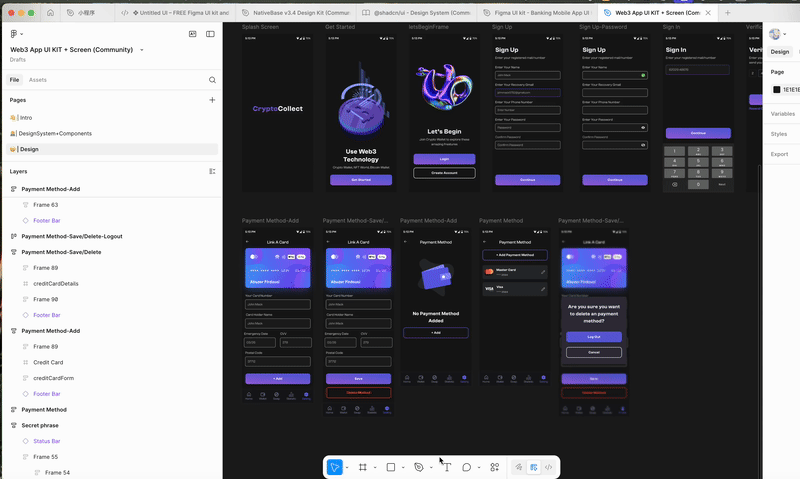

# Figma AI Auto Naming

> **English** | [中文](#中文)

**AI-powered Figma plugin that automatically generates semantic, meaningful names for your design elements.**

[](https://www.typescriptlang.org/)
[](https://www.figma.com/)
[](https://expressjs.com/)

## 🎯 Overview

**Figma AI Auto Naming** is an intelligent Figma plugin that uses AI technology to automatically generate semantic, meaningful names for your design elements. Save time and maintain consistency across your design files with AI-powered naming suggestions.

## 🎬 Demo

Watch the plugin in action:

### MP4 Format (Recommended)

<video width="100%" controls>
  <source src="figmaUI/docs/录屏.mp4" type="video/mp4">
  Your browser does not support the video tag. Please <a href="figmaUI/docs/录屏.mp4">download the video</a> to view.
</video>

📥 [Download MP4 Video](figmaUI/docs/录屏.mp4)

### GIF Format



📥 [Download GIF](figmaUI/docs/录屏.gif)

### ✨ Key Features

- 🤖 **AI-Powered Naming**: Automatically generates semantic names based on element type, description, and context
- 🖼️ **Visual Analysis**: Supports screenshot analysis - AI understands element appearance and functionality
- 📦 **Batch Processing**: Process multiple frames and their children in one go
- 🎯 **Frame Structure Analysis**: Analyze entire frame structures and return all nodes that need naming
- 🔍 **Smart Recognition**: Automatically identifies FRAME, COMPONENT, GROUP, BUTTON, INSTANCE, and more
- 💡 **Context-Aware**: Generates accurate names by understanding element descriptions, parent info, and sibling elements

### 📦 What's Included

- **Figma Plugin** (`figmaUI/`): Plugin interface and logic running in Figma
- **AI Service Backend** (`server/`): Express server providing AI naming services

---

## 🚀 Quick Start

### Prerequisites

- Node.js 16+
- npm or yarn
- Figma Desktop App
- OpenAI API Key (for AI naming service)

### Installation

1. **Clone the repository**
   ```bash
   git clone <repository-url>
   cd Figma-AI-AutoName
   ```

2. **Install dependencies**
   ```bash
   # Install plugin dependencies
   cd figmaUI
   npm install
   
   # Install server dependencies
   cd ../server
   npm install
   ```

3. **Configure backend service**
   
   Create `.env` file in `server/` directory:
   ```env
   OPENAI_API_KEY=your_openai_api_key_here
   PORT=3000
   ```

4. **Build and run**
   ```bash
   # Build plugin
   cd ../figmaUI
   npm run build
   
   # Start server (development mode)
   cd ../server
   npm run dev:tsx
   ```

5. **Load plugin in Figma**
   - Open Figma Desktop App
   - Go to `Plugins` > `Development` > `Import plugin from manifest...`
   - Select `figmaUI/manifest.json`
   - Plugin will appear in `Plugins` > `Development` menu

## 📖 Usage

1. Select elements (Frame, Component, etc.) in Figma canvas
2. Run plugin: `Plugins` > `Development` > `AI Auto Naming`
3. Plugin automatically calls backend service to generate naming suggestions
4. Review and apply suggested names

## 🛠️ Development

### Plugin Development
```bash
cd figmaUI
npm run watch  # Watch mode, auto-compile
```

### Server Development
```bash
cd server
npm run dev:tsx  # Direct run with tsx, no build needed
```

## 📡 API Documentation

The backend server provides RESTful API endpoints:

- `GET /health` - Health check
- `POST /api/name` - Single element naming
- `POST /api/name/batch` - Batch naming
- `POST /api/name/frame` - Frame structure naming (recommended)

For detailed API documentation, see [server/README.md](server/README.md).

## 🔧 Tech Stack

- **Language**: TypeScript 5.0+
- **Build Tool**: esbuild
- **Figma API**: Figma Plugin API 1.0.0
- **Backend**: Express 4.18
- **AI Model**: OpenAI GPT-4o (with vision support)

## 📄 License

MIT License

---

## 中文

一个强大的 Figma 插件，使用 AI 技术自动为 Figma 设计元素生成合适的命名。

## 📋 目录

- [项目简介](#项目简介)
- [演示视频](#演示视频)
- [功能特性](#功能特性)
- [项目结构](#项目结构)
- [快速开始](#快速开始)
- [开发指南](#开发指南)
- [API 文档](#api-文档)
- [技术栈](#技术栈)
- [许可证](#许可证)

## 🎯 项目简介

Figma AI Auto Naming 是一个智能的 Figma 插件，通过 AI 技术帮助设计师和开发者自动为 Figma 设计元素生成语义化、规范的命名。插件由两部分组成：

- **Figma 插件前端** (`figmaUI/`): 运行在 Figma 中的插件界面和逻辑
- **AI 服务后端** (`server/`): 提供 AI 命名服务的 Express 服务器

## 🎬 演示视频

查看插件使用演示：

### MP4 格式（推荐）

<video width="100%" controls>
  <source src="figmaUI/docs/录屏.mp4" type="video/mp4">
  您的浏览器不支持视频播放。请<a href="figmaUI/docs/录屏.mp4">下载视频</a>查看。
</video>

📥 [下载 MP4 视频](figmaUI/docs/录屏.mp4)

### GIF 格式


📥 [下载 GIF 动图](figmaUI/docs/录屏.gif)

## ✨ 功能特性

### Figma 插件端

- 🤖 **AI 智能命名**: 基于元素类型、描述和上下文自动生成合适的命名
- 🖼️ **视觉分析**: 支持截屏图片分析，AI 可以理解元素的外观和功能
- 📦 **批量命名**: 支持批量处理多个 frame 及其子元素
- 🎯 **Frame 结构分析**: 一次性分析整个 frame 结构，返回所有需要命名的节点
- 🔍 **智能识别**: 自动识别 FRAME、COMPONENT、GROUP、BUTTON、INSTANCE 等元素类型
- 💡 **上下文理解**: 结合元素描述、父级信息、同级元素等上下文生成更准确的命名

### 后端服务

- 🚀 **RESTful API**: 提供标准的 REST API 接口
- 📡 **多种命名模式**: 支持单个元素命名、批量命名和 Frame 结构命名
- 🖼️ **视觉模型支持**: 集成 GPT-4o 视觉模型，支持图片分析
- ⚡ **并发处理**: 批量命名支持并发处理，提高效率
- 🔒 **环境变量配置**: 支持通过环境变量配置 API Key

## 📁 项目结构

```
Figma-AI-AutoName/
├── figmaUI/              # Figma 插件前端
│   ├── src/              # TypeScript 源代码
│   │   ├── code.ts       # 插件主逻辑
│   │   └── ai-service.ts # AI 服务调用
│   ├── assets/           # 资源文件
│   │   ├── ui.html       # 插件 UI 界面
│   │   └── icon.png      # 插件图标
│   ├── scripts/          # 构建脚本
│   ├── manifest.json     # Figma 插件清单
│   └── README.md         # 插件详细文档
│
├── server/               # AI 服务后端
│   ├── index.ts          # Express 服务器入口
│   ├── dist/             # TypeScript 编译输出
│   └── README.md         # 服务器详细文档
│
├── .gitignore           # Git 忽略文件
└── README.md            # 项目主文档（本文件）
```

## 🚀 快速开始

### 前置要求

- Node.js 16+
- npm 或 yarn
- Figma 桌面应用
- OpenAI API Key（用于 AI 命名服务）

### 安装步骤

#### 1. 克隆项目

```bash
git clone <repository-url>
cd Figma-AI-AutoName
```

#### 2. 安装依赖

```bash
# 安装插件依赖
cd figmaUI
npm install

# 安装服务器依赖
cd ../server
npm install
```

#### 3. 配置后端服务

在 `server/` 目录下创建 `.env` 文件：

```bash
cd server
cp .env.example .env  # 如果存在 .env.example
```

编辑 `.env` 文件：

```env
OPENAI_API_KEY=your_openai_api_key_here
PORT=3000
```

#### 4. 构建项目

```bash
# 构建插件
cd ../figmaUI
npm run build

# 构建服务器（可选，开发模式不需要）
cd ../server
npm run build
```

#### 5. 启动服务

**启动后端服务器**（开发模式）：

```bash
cd server
npm run dev:tsx
```

服务器将在 `http://localhost:3000` 启动。

**在 Figma 中加载插件**：

1. 打开 Figma 桌面应用
2. 进入 `Plugins` > `Development` > `Import plugin from manifest...`
3. 选择 `figmaUI/manifest.json` 文件
4. 插件将出现在 `Plugins` > `Development` 菜单中

#### 6. 使用插件

1. 在 Figma 画布中选择需要命名的元素（Frame、Component 等）
2. 运行插件：`Plugins` > `Development` > `AI Auto Naming`
3. 插件会自动调用后端服务生成命名建议
4. 确认后应用命名

## 🛠️ 开发指南

### 开发模式

**插件开发**：

```bash
cd figmaUI
npm run watch  # 监听模式，自动编译
```

**服务器开发**：

```bash
cd server
npm run dev:tsx  # 使用 tsx 直接运行，无需构建
```

### 可用脚本

#### Figma 插件 (`figmaUI/`)

| 命令 | 说明 |
|------|------|
| `npm run build` | 编译 TypeScript 并打包 |
| `npm run watch` | 监听模式，自动编译 |
| `npm run icon` | 生成插件图标 |
| `npm run convert-video` | 转换演示视频格式 |

#### 后端服务器 (`server/`)

| 命令 | 说明 |
|------|------|
| `npm run build` | 编译 TypeScript |
| `npm start` | 运行编译后的代码 |
| `npm run dev` | 监听模式（需要先构建） |
| `npm run dev:tsx` | 开发模式（推荐，无需构建） |

## 📡 API 文档

后端服务器提供以下 API 接口：

### 健康检查

```http
GET /health
```

### 单个元素命名

```http
POST /api/name
Content-Type: application/json

{
  "nodeId": "123:456",
  "nodeName": "Button",
  "nodeType": "COMPONENT",
  "nodeDescription": "主要按钮组件",
  "context": "这是页面头部的主要操作按钮",
  "screenshot": "data:image/png;base64,..."  // 可选
}
```

### 批量命名

```http
POST /api/name/batch
Content-Type: application/json

{
  "frames": [
    {
      "nodeId": "123:456",
      "nodeName": "Frame1",
      "nodeType": "FRAME",
      "context": "这是页面头部容器"
    }
  ]
}
```

### Frame 结构命名（推荐）

```http
POST /api/name/frame
Content-Type: application/json

{
  "frameData": {
    "frame": {...},
    "components": {...},
    "designTokens": {...},
    "metadata": {...}
  },
  "screenshot": "data:image/png;base64,..."  // 可选
}
```

详细的 API 文档请参考 [server/README.md](server/README.md)。

## 🔧 技术栈

### Figma 插件

- **语言**: TypeScript 5.0+
- **构建工具**: esbuild
- **Figma API**: Figma Plugin API 1.0.0

### 后端服务

- **语言**: TypeScript 5.3+
- **框架**: Express 4.18
- **运行时**: Node.js 20+
- **AI 模型**: OpenAI GPT-4o（支持视觉分析）

## 📝 环境变量

### 后端服务器 (`server/.env`)

- `OPENAI_API_KEY` (必需): OpenAI API Key
- `PORT` (可选): 服务器端口，默认 3000

## 🔒 安全注意事项

1. **API Key 安全**: 永远不要将 `.env` 文件提交到版本控制系统
2. **网络访问**: 插件配置了允许的域名，确保只访问可信的服务器
3. **请求限制**: 后端服务器设置了请求体大小限制（50MB）

## 📄 许可证

本项目采用 MIT 许可证。

## 🤝 贡献

欢迎提交 Issue 和 Pull Request！

## 📚 相关文档

- [Figma 插件详细文档](figmaUI/README.md)
- [后端服务详细文档](server/README.md)
- [Figma Plugin API 文档](https://www.figma.com/plugin-docs/)

---

**提示**: 使用过程中遇到问题，请查看各子项目的 README 文档或提交 Issue。

